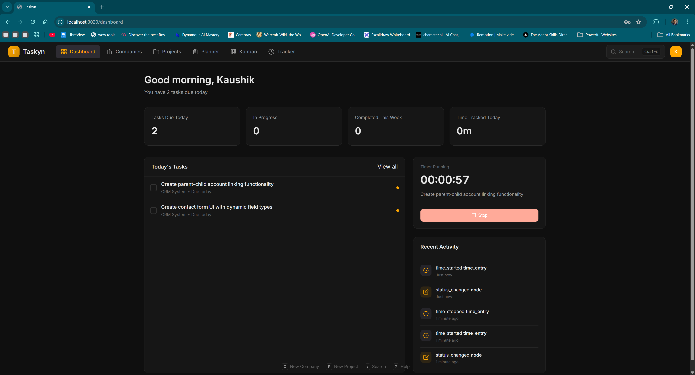
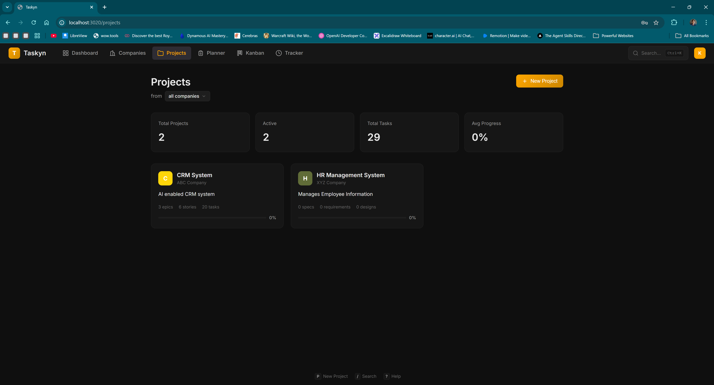
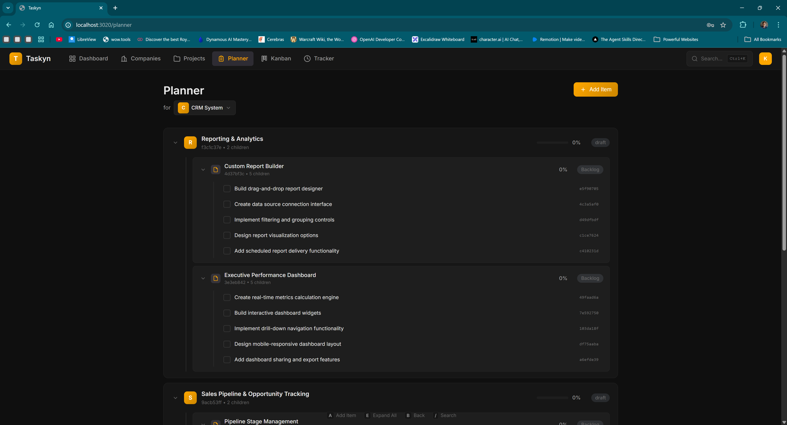

# Taskyn

AI-first project management system designed for both human and AI interaction. Manage projects, track time, and orchestrate work through MCP (Model Context Protocol) or a browser-based Web UI.



---

## Screenshots

### Project Overview
Track specs, stories, and tasks across multiple projects with real-time status updates.



### Node Detail View
Drill into any work item — see description, status, time logged, child nodes, and relationships.



---

## Highlights

| Feature | Description |
|---------|-------------|
| **AI-Native** | Full MCP server — Claude, GPT, and other AI assistants manage your projects directly |
| **Graph-Based Tracking** | Nodes (specs, stories, tasks) connected by edges (parent, blocks, depends_on) |
| **Methodology System** | Classic Agile or Spec-Driven (gated workflow) — or define your own |
| **Time Tracking** | Timer-based or manual time logging with per-node rollups |
| **Web UI** | Browser-based interface for visual project management |
| **Zero Config** | Single `docker compose up` — no database setup, no config files |

---

## Quick Start

```bash
curl -O https://raw.githubusercontent.com/kaushikhazra/Taskyn/develop/docker-compose.yml
docker compose up -d
```

That's it. Docker pulls the images automatically.

| Service | URL |
|---------|-----|
| Web UI | http://localhost:3020 |
| MCP Server | http://localhost:8020/mcp |

---

## MCP Server Setup

Taskyn speaks MCP natively. Connect any MCP-compatible AI assistant to your running Taskyn server.

### Claude Desktop

Add to your config file:

| OS | Config Path |
|----|------------|
| Windows | `%APPDATA%\Claude\claude_desktop_config.json` |
| macOS | `~/Library/Application Support/Claude/claude_desktop_config.json` |
| Linux | `~/.config/Claude/claude_desktop_config.json` |

```json
{
  "mcpServers": {
    "taskyn": {
      "transport": "streamable-http",
      "url": "http://localhost:8020/mcp"
    }
  }
}
```

After saving, **fully quit Claude Desktop** (check system tray) and restart.

### Claude Code

Add to `~/.claude/settings.json` or use `claude mcp add`:

```json
{
  "mcpServers": {
    "taskyn": {
      "transport": "streamable-http",
      "url": "http://localhost:8020/mcp"
    }
  }
}
```

### Using mcp-proxy

For clients that don't support streamable-http, use [mcp-proxy](https://github.com/punkpeye/mcp-proxy):

```json
{
  "mcpServers": {
    "taskyn": {
      "command": "mcp-proxy",
      "args": ["http://localhost:8020/mcp"]
    }
  }
}
```

---

## MCP Tools Reference

| Category | Tools |
|----------|-------|
| Company | `pm_list_companies`, `pm_create_company`, `pm_get_company`, `pm_update_company`, `pm_delete_company` |
| Project | `pm_list_projects`, `pm_create_project`, `pm_get_project`, `pm_update_project`, `pm_delete_project`, `pm_get_methodology_info` |
| Milestone | `pm_list_milestones`, `pm_create_milestone`, `pm_complete_milestone`, `pm_update_milestone`, `pm_delete_milestone` |
| Node | `pm_list_nodes`, `pm_create_node`, `pm_get_node`, `pm_update_node`, `pm_start_node`, `pm_complete_node`, `pm_block_node`, `pm_delete_node` |
| Edge | `pm_list_edges`, `pm_create_edge`, `pm_delete_edge`, `pm_get_ancestors`, `pm_get_descendants` |
| Timer | `pm_start_timer`, `pm_stop_timer`, `pm_log_time`, `pm_get_active_timer`, `pm_list_time_entries` |
| Reporting | `pm_get_dashboard`, `pm_get_project_stats`, `pm_get_company_stats`, `pm_search`, `pm_get_recent_activity`, `pm_get_rollup` |
| Tag | `pm_list_tags`, `pm_create_tag`, `pm_tag_node`, `pm_untag_node`, `pm_delete_tag` |

---

## Methodologies

### Classic Agile (default)

| Aspect | Details |
|--------|---------|
| Node types | `story`, `task` |
| Edge types | `parent` (task -> story), `depends_on` |
| Story statuses | backlog -> ready -> in_progress -> done |
| Task statuses | todo -> in_progress -> done |

### Spec-Driven

A gated workflow where each phase must complete before the next begins.

| Phase | Statuses | Purpose |
|-------|----------|---------|
| Spec | draft -> approved -> done | Define requirements |
| Design | draft -> in_review -> approved | Architecture decisions |
| Implementation | todo -> in_progress -> in_review -> done | Build it |
| Validation | pending -> in_progress -> passed / failed | Verify it works |

---

## Architecture

### High-Level Overview

```
┌──────────────────────────────────────────────────────┐
│                   USER / AI CLIENT                    │
│         (Browser, Claude Desktop, Claude Code)        │
└────────────┬─────────────────────────┬───────────────┘
             │ HTTP :3020              │ MCP :8020
             ▼                         ▼
┌────────────────────────┐  ┌─────────────────────────┐
│      taskyn-web        │  │      taskyn-core         │
│  FastAPI + React UI    │──│  MCP Server (FastMCP)    │
│  REST API, JWT Auth    │  │  Graph Engine, SQLite    │
│  Port 3020             │  │  Port 8020               │
└────────────────────────┘  └─────────────────────────┘
```

### Tech Stack

| Layer | Technology |
|-------|-----------|
| **MCP Server** | Python 3.12, FastMCP, Pydantic |
| **Web Backend** | FastAPI, Uvicorn, python-jose (JWT) |
| **Web Frontend** | React, TypeScript, Vite |
| **Database** | SQLite (zero config, file-based) |
| **Containerization** | Docker, multi-stage builds |
| **CI/CD** | GitHub Actions, Docker Hub |

### Project Structure

```
src/taskyn/
├── db/                 # Database layer (SQLite, Pydantic models)
├── graph/              # Graph engine (nodes, edges, traversal)
├── core/               # Business logic (workflow, time tracking, tags)
├── methodologies/      # Pluggable PM methodologies
├── mcp/                # MCP server (FastMCP tools & resources)
├── web/
│   ├── backend/        # FastAPI REST API + JWT auth
│   └── frontend/       # React + TypeScript UI
└── cli/                # Typer CLI (development use)
```

---

## Docker Images

| Image | Description |
|-------|-------------|
| [`kaushikhazra/taskyn-core`](https://hub.docker.com/r/kaushikhazra/taskyn-core) | MCP server — all data operations |
| [`kaushikhazra/taskyn-web`](https://hub.docker.com/r/kaushikhazra/taskyn-web) | Web UI + FastAPI backend |

### Managing Taskyn

```bash
docker compose ps       # Check status
docker compose logs -f  # View logs
docker compose down     # Stop
docker compose pull     # Update to latest images
```

### Environment Variables

| Variable | Default | Description |
|----------|---------|-------------|
| `TASKYN_DB` | `/data/taskyn.db` | Database path |
| `TASKYN_ACTOR` | `mcp` | Actor ID for activity logs |
| `TASKYN_MCP_PORT` | `8020` | MCP server port |
| `TASKYN_MCP_HOST` | `0.0.0.0` | MCP bind address |
| `TASKYN_MCP_URL` | `http://taskyn-core:8020/mcp` | MCP server URL (web backend) |
| `TASKYN_JWT_SECRET` | (dev default) | JWT signing secret — change in production |

### Data Persistence

Data is stored in Docker named volumes (`taskyn-data` and `taskyn-web-data`). These persist across container restarts and updates.

---

## Troubleshooting

### MCP Connection Issues

| Problem | Solution |
|---------|----------|
| "Server disconnected" in Claude Desktop | Run `docker compose ps` to verify Taskyn is running, then fully quit and restart Claude Desktop |
| "Not Acceptable" with mcp-proxy | Update mcp-proxy: `pip install --upgrade mcp-proxy` |
| MCP server not responding | `curl http://localhost:8020/mcp` — if no response, check `docker compose logs taskyn-core` |

### Docker Issues

| Problem | Solution |
|---------|----------|
| Container unhealthy | `docker compose logs taskyn-core` or `docker compose logs taskyn-web` |
| Port already in use | Change mapping in `docker-compose.yml`: `"8021:8020"` |

---

## Development

For contributors building from source:

```bash
git clone https://github.com/kaushikhazra/Taskyn.git
cd Taskyn
pip install -e ".[dev,web]"
```

| Command | Purpose |
|---------|---------|
| `pytest` | Run all tests |
| `pytest --cov=taskyn` | Run with coverage |
| `docker compose -f docker-compose.dev.yml up -d --build` | Local Docker build |
| `python scripts/dev_server.py` | Run backend + frontend dev servers |

---

## License

MIT License - see [LICENSE](LICENSE)
